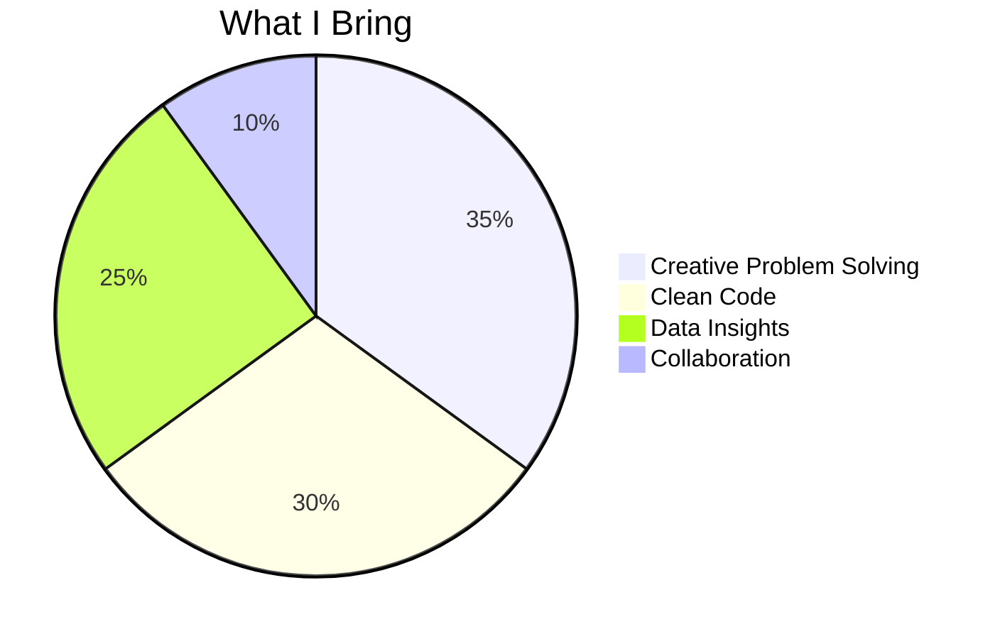
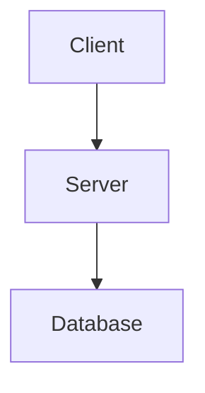
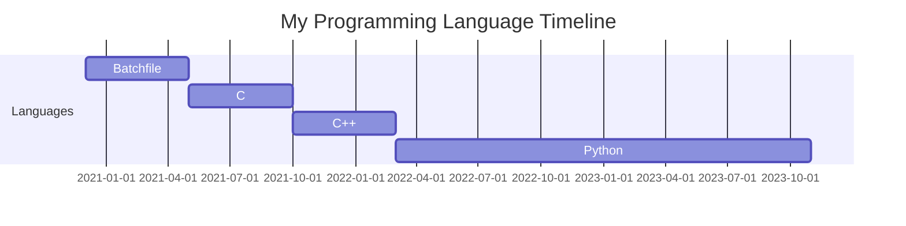

# 🌌 Welcome to My GitHub Universe!
[;Not+afraid+of+segfaults...+just+disappointed;Will+code+for+snacks;Documentation?+I+barely+know+her!;Life+before+death,+strength+before+weakness+tests+before+commits;Ctrl+C,+Ctrl+V+enthusiast)](https://github.com/YegonGodwin/readme-typing-svg)

## 🚀 About Me

<div align="center">

| **Role**              | **Skills**               | **Passions**            |
|-----------------------|--------------------------|-------------------------|
| 💻 Software Developer |    | 🧠 Machine Learning |
| 📊 Data Scientist     |    | 🔍 Data Analysis |
| 🌐 Problem Solver     |    | 🛠️ Building Solutions |

</div>

## 🔥 Core Strengths



### 🛠️ Tech Stack


 
 


***

### 🛠️ Frameworks & Libraries

 [](https://reactjs.org/)
 [](https://nodejs.org/)
 [](https://www.djangoproject.com/)
 [](https://scikit-learn.org/)
 [](https://pandas.pydata.org/)
 [](https://numpy.org/)
 [](https://shiny.posit.co/)
 [](https://matplotlib.org/)

   ---

### ⚙️ Tools & Platforms

 [](https://git-scm.com/)
 [](https://www.docker.com/)
 [](https://code.visualstudio.com/)
 [](https://posit.co/products/open-source/rstudio/)
---
### 💻 Most Used Languages
 
  ---
  ### 📊 My GitHub Stats


---
## Streaks

## 📊 Project Structure

## 🎥 Demo


---


## My Coding Journey Timeline



### 5. **GitHub Skyline**
For a 3D visualization of your activity:
```markdown
[](https://skyline.github.com)

```
---

📫 Let’s Connect!

I’m always open to collaborating on exciting projects, discussing ideas, or just having a chat. Feel free to reach out to me.
### 🌐 Connect with Me

[](https://x.com/FlynnGoodie)
[](https://instagram.com/godwinkibette)
[](https://linkedin.com/in/godwinkibet)

---
### 🏅 GitHub Profile Badges

- **Followers**:           [](https://github.com/YegonGodwin)
- **Public Repositories**: [](https://github.com/yourusername?tab=repositories)
 ---
- **GitHub Trophy**:       [](https://github.com/YegonGodwin)


---
[](https://github.com/YegonGodwin/readme-typing-svg)

## ✨✨ Mascot
**coming soon... 🤡😈😎**
<!---
YegonGodwin/YegonGodwin is a ✨ special ✨ repository because its `README.md` (this file) appears on your GitHub profile.
You can click the Preview link to take a look at your changes.
--->
